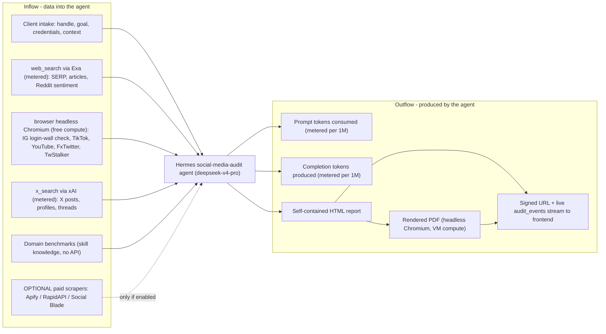
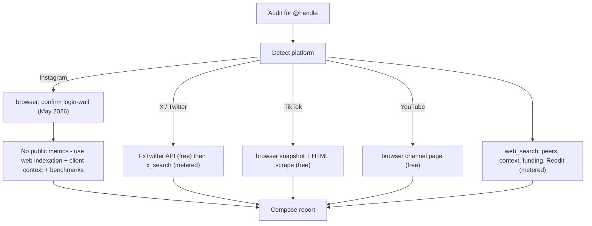

# Data Sources & Billing

How a single AuditLayer audit consumes data and money — what flows **into** the
Hermes agent (research) and what flows **out** (tokens + artifacts), with a
cost-driver table reconciled against the `$0.60–$1.80/audit, $3 cap` target, and
a clear answer on whether paid social-media data sources are needed at launch.

Scope: the automated worker pipeline (`worker/`) calling the Hermes Gateway
(`deepseek-v4-pro`) with toolsets `web`, `browser`, `x_search`, per the
`social-media-audit` skill.

---

## 1. Inflow vs. Outflow

**Inflow** = everything the agent pulls in to research the subject. Some inflow
is *metered* (you pay per call/scrape), some is *free* (browser compute on the
VM, or skill knowledge). **Outflow** = what the model produces and where it
goes: tokens billed by the model provider, plus the HTML/PDF artifacts and their
delivery.

### Inflow detail (what each source reliably returns)

Key inflow facts (from the `social-media-audit` skill):

- **Instagram is login-walled** for all unauthenticated profile views (see
  `INSTAGRAM_LIMITATION` in the worker `core.py`). The free toolsets **cannot**
  reliably retrieve live IG follower/engagement counts. The pipeline confirms
  the wall via `browser`, then pivots to web indexation + client-supplied
  context + domain benchmarks, and marks missing metrics as a data-quality
  limitation rather than guessing.
- **X / Twitter** is well-covered for free via the FxTwitter API
  (`api.fxtwitter.com/<handle>`), with `x_search` (metered) and TwStalker as
  fallbacks.
- **TikTok / YouTube** profile-level data (followers, video count, hearts, bio)
  is reachable via the free `browser` toolset.
- **`web_search`** (Exa) supplies peer discovery, business context, funding, and
  Reddit sentiment — this is the workhorse metered source.
- **`browser`** navigations run as headless Chromium on the Hetzner VM, so they
  cost only VM compute (folded into fixed infra), not per-call fees.

---

## 2. Cost-driver table (per single audit)

Model token rates use the worker defaults for `deepseek-v4-pro`-class pricing
(`AUDITLAYER_PRICE_IN_PER_MTOK=0.27`, `AUDITLAYER_PRICE_OUT_PER_MTOK=1.10`);
set these to your contracted rates. Tool-call rates are xAI's published
`$5 / 1,000 calls` ($0.005/call) for `web_search` and `x_search` (verified Jun
2026). Browser fetches and PDF rendering are VM compute, amortized into infra.

| Cost driver | Billing unit | Approx. unit cost | Typical qty / audit | Per-audit cost |
|---|---|---|---|---|
| LLM input tokens (`deepseek-v4-pro`, full agentic loop) | per 1M input tok | ~$0.27 / 1M | 150K–400K | $0.04–$0.11 |
| LLM output tokens (report HTML + reasoning) | per 1M output tok | ~$1.10 / 1M | 30K–50K | $0.03–$0.06 |
| `web_search` (Exa via Hermes) | per call | ~$0.005 | 8–16 | $0.04–$0.08 |
| `x_search` (xAI) | per call | $0.005 | 0–10 (X targets only) | $0.00–$0.05 |
| `browser` navigations (FxTwitter, TikTok, YouTube, IG wall, TwStalker) | VM compute | ~$0 marginal | 5–20 | ~$0.00 |
| PDF render (headless Chromium) | VM compute | ~$0 marginal | 1 | ~$0.00 |
| Supabase Storage + egress (HTML+PDF, ~0.2–1 MB) | per GB stored/egress | negligible at pilot scale | 1 | <$0.01 |
| Fixed infra (CX22 VM + Cloudflare Tunnel), amortized | per audit | ~$4.90/mo ÷ volume | 1 | ~$0.05 @ 100/mo |
| **Per-audit total (free-toolset path)** | | | | **~$0.30–$1.00** |

**Reconciliation with the `$0.60–$1.80` target:** the documented band assumed a
frontier-class model. With `deepseek-v4-pro`, **token cost is the smaller
component** and the metered **search APIs dominate** the variable cost. A typical
audit lands at **~$0.30–$1.00**, inside/under the `$0.60–$1.80` band and far
under the **$3/audit hard cap**. The cap is enforced as a safety net via
`app_settings.cost_cap_usd` / `token_cap` (read live by the worker) and recorded
per audit as `tokens_in` / `tokens_out` / `cost_usd`.

If a paid scraper is enabled (next section), add its per-profile cost on top
(e.g. +$0.001–$0.005/profile for Apify IG/TikTok), which is immaterial against
the cap.

---

## 3. Are external / paid social-media data sources needed?

**Short answer: not required to launch, but recommended for one specific gap —
Instagram metrics — once IG-primary audits become a meaningful share of volume.**

### What the free toolsets can and cannot get

| Platform | Free coverage (web / browser / x_search / FxTwitter) | Reliable live metrics? |
|---|---|---|
| X / Twitter | FxTwitter API + x_search + TwStalker | **Yes** (followers, tweets, bio) |
| TikTok | browser snapshot + HTML scrape | **Yes** (followers, videos, hearts) |
| YouTube | browser channel page | **Yes** (subs, video count) |
| **Instagram** | login-walled; only web indexation + og:description meta when present | **No** — this is the gap |

The structural limitation is **Instagram**: as of May 2026 it login-gates all
unauthenticated profile views, and third-party viewers (Picuki, Dumpor, Imginn,
etc.) and Social Blade are Cloudflare-blocked. For IG-primary subjects the free
path produces a credible *strategic* audit (benchmarks, peer patterns,
positioning) but **cannot** state current follower/engagement numbers without
client-supplied data. That is acceptable for the product (limitations are shown
plainly), but it weakens IG audits where the client wants their real numbers
reflected.

### Concrete paid options (approx. pricing, verified Jun 2026)

| Provider | What it unlocks | Approx. price | Notes |
|---|---|---|---|
| **Apify IG Profile Scraper** (`figue` / `apify` / others) | IG followers, bio, recent posts, engagement — no login | **$1.00–$1.60 / 1,000 profiles** (~$0.001–$0.0016 each) | Pay-per-result; cheapest reliable IG fix. Post/Reels scrapers cost more ($4–5/1K). |
| **Apify TikTok / YouTube scrapers** | Exact video stats | ~$0.001 / video | Redundant with free browser path; useful for batch/exact counts. |
| **RapidAPI IG providers** (e.g. Instagram Scraper API) | Profile + media JSON | ~$10–$50 / mo tiers (~10K–100K calls) | Subscription model; variable reliability, watch rate limits. |
| **Social Blade API** | Historical growth trends, ranks | Paid API tiers (business plans) | Good for trajectory/history; their public site is Cloudflare-blocked to scrapers, so the API is the only reliable route. |
| **Official Meta Graph API** | First-party IG metrics | Free, but requires the **client to connect their IG Business/Creator account** via OAuth | Most accurate + ToS-clean, but adds an onboarding step and app-review overhead. |
| **Official YouTube Data API** | Channel/video stats | Free up to generous quota | Cheap upgrade for exact YT data if YT becomes important. |
| **Official TikTok Display API** | Profile/video stats | Free, requires user OAuth + app approval | Similar tradeoff to Meta Graph. |

### Recommendation for launch

1. **Launch on the free toolsets.** They fully cover X, TikTok, and YouTube, and
   produce a credible, limitation-flagged audit for Instagram. Per-audit cost
   stays at ~$0.30–$1.00, well under the cap, and there is no extra vendor
   onboarding or ToS exposure. The product already treats missing IG metrics as
   an honest data-quality note, which fits the "evidence-based, no guessing"
   positioning.
2. **Add one paid IG fallback behind an admin/`app_settings` flag** as a fast
   follow: the **Apify IG Profile Scraper at ~$1/1,000 profiles**. At one scrape
   per IG audit this adds ~$0.001 — negligible against the $3 cap — and closes
   the only real data gap. Wire it as an optional inflow (the dotted `Paid` node
   above) the worker calls *only when* the subject is Instagram and live metrics
   are wanted; record the spend as a data-API line on the audit.
3. **Prefer the official Meta Graph API for high-value / recurring clients.**
   When a paying client will connect their own IG Business account, first-party
   metrics are free, exact, and ToS-clean — better than any scraper. Offer the
   OAuth connect as a Pro/Enterprise onboarding step rather than a launch
   blocker.
4. **Skip Social Blade / RapidAPI subscriptions at launch.** Only add Social
   Blade's paid API if growth-trajectory/history becomes a headline feature;
   it's a fixed monthly cost that isn't justified by pilot volume.

Net: **no paid data source is required to ship.** Budget a small, flag-gated
Apify IG fallback (~$0.001/audit) as the single highest-leverage paid addition,
and treat official platform APIs as the premium, client-connected path.
